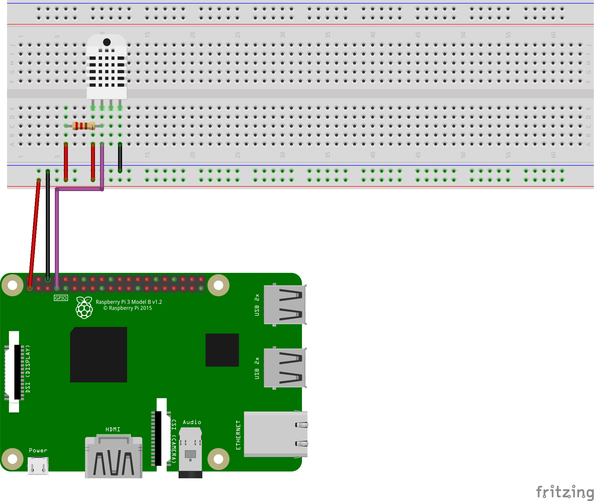

# Grundlegende einrichtungen des Raspberry

Über das File `ssh` wird automatisch ssh auf dem Raspberry-Pi aktiviert. 
Dieses File hat keinen inhalt und wird in das Boot verzeichnis der SD-Karte gezogen.

Zusätzlich wird das File `wpa_supplicant.conf` erstellt.

Dieses File hat folgenden Inhalt:
``` sh
ctrl_interface=DIR=/var/run/wpa_supplicant GROUP=netdev
update_config=1
country=DE

network={
   ssid="wlan_ssid_eintragen"
   scan_ssid=1
   psk="wlan_passwort_eintragen"
}
}
```

Durch dieses verbindet der Raspberry-Pi sich automatisch mit dem darin angegebenen WLAN.
## Setup-Script


Weiter kann das Script `setup.sh` ausgeführt werden. 

Durch dieses Script werden alle benötigten Programme und Librarys installiert.

Zuerst werden Updates Installiert.

Danach werden mehrere Python Librarys importiert.

- DHT-Sensor Library
- MySQL Library

## Raspberry Verkabelung

Ein DHT22 Sensor wird wie Folgt an den Raspberry-Pi angeschlossen.
| | | | |
|--|--|--|--|
|1 |=|VCC| 3.3V |
|2 |=|Data| GPIO 4|
|3 |=|none| -
|2 |=|GND|  GND
|


Beachtet werden muss noch das ein Wiederstand zwischen Data und VCC gelegt werden muss. Der wiederstand muss einen Wiederstand zwischen 4.7KΩ und 10.0 KΩ liegen.

Achtung bei gewissen Sensoren ist schon ein Wiederstand aufgelötet. Diese Sensoren erkennt mann grundsätzlich daran das sie nur 3Pins besitzen. 


