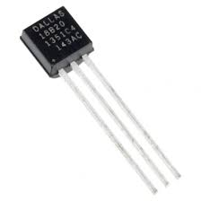
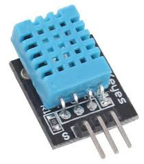
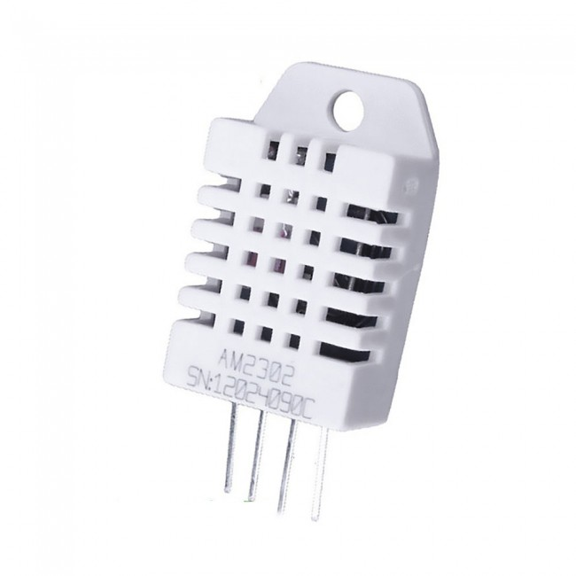
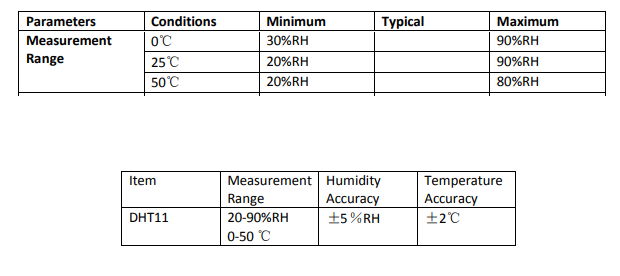
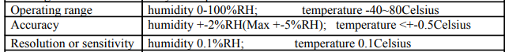

# RasPi Temp
## Auftrag
Ich sollte für den ICT-BZ Serverraum eine Temperatur/Feuchtigkeits anzeige erstellen. Dies soll in einem Graphen visualisert werden. 

## Vorgehen
### DS18B20
Als erstes habe ich mit einem [DS18B20](./02_02DS18B20) Sensor gearbeitet. Das auslesen der Daten funktioniert dort über eine Shell-Schnitstelle. 



Die Funktionen dieses Sensores sind aber recht eingeschränkt. Das genaue Vorgehen für diesen Sensor ist [HIER](./02_DS18B20/README.md) Dokumentiert. 


### DHT11
Da aber der Wunsch aufkam auch die Luftfeuchtigkeit aufzuzeigen habe ich von Joe einen [DHT11](./05_DHT11) Sensor ausgeliehen. 
Dieser kann sowohl die Luftfeuchtigkeit als auch die Temperatur messen. 



Über ein Pythonmodul ``` Adafruit_DHT ``` kann ein solcher sensor ganz eifach ausgelesen werden. 

Über nur 4 Zeilen Code kann der Sensor ganz einfach ausgelesen und geprintet werden.

```python
# Definieren des Sensortyps
sensor = Adafruit_DHT.DHT11
    #Definieren des Verwendetens GPIO-Pin's
    pin = 21
    # Hier definiere ich aus was sich die "humidity" und die "temperature" zusammensetzt. 
    humidity, temperature = Adafruit_DHT.read_retry(sensor, pin)
    # Ausgeben der Daten im richtigen Format
    print('{0:03.1f} {1:03.1f}'.format(temperature, humidity))
```
Über ein weiteres Pythonmodul namens ```mysql.connector``` kann wie der Name schon sagt auf eine MySQL Datenbank zugegriffen werden. 

Auch dies Ist ganz simple. Das ganze ist auf der Website von [w3schools.com](https://www.w3schools.com/python/python_mysql_getstarted.asp "Link zu w3shools.com") perfekt dokumentiert.

```python
# Hier definiere ich die Zugangsdaten der Datenbank
mydb = mysql.connector.connect(
    host="IP-Des Hostes", 
    user="DB-Username",
    password="DB-Password",
    database="database-name")
mycursor = mydb.cursor()
#Inser values into db
        sql = "INSERT INTO sensor_1 (time, humidity, temperature) VALUES (now(), %s,%s)"
        val = (humidity, temperature)
        mycursor.execute(sql, val)
        mydb.commit()
```
Beim längeren schreiben in die Datenbank ist aufgefallen das die Feuchtigkeit immer auf ca. dem  selben wert beleibt. Anfäglich habe ich mir nichts dabe gedacht. 

| Time                  | humidity      |temperature    |
| ----------------------|--------------:|--------------:|
| 2020-01-22 15:01:45   | 5.00          |23.00          |
| 2020-01-22 15:03:50   | 5.00          |23.00          |
| 2020-01-22 15:03:55   | 5.00          |23.00          |

Nach dem ich Rainer darauf angesprochen habe, hat er mich darauf aufmerksam gemacht, das der Sensor erst ab 25℃ korrekt funktioniert.

Dies hätte ich dem Datenblatt entnehmen können, dies habe ich aber nicht durchgelesen. 

Rainer hat mit mir zusammen dann ein Experiment durchgeführt, in welchem wir dann eine Tasse heisses Wasser neben den Sensor gestellt haben und einen Deckel Darüber gelegt haben. Der Anststieg der Temperatur und der Feuchtigkeit konnte dann perfekt gesehen werden. 

Dort habe ich auch gelesen das es einen weiteren Sensor DHT22 gibt. 
Die Sensoren sind gleich aufgebaut. Der DHT22 ist einfach viel genauer und hat eine grössere Betriebstemparatur.




Hier in einem Screenshot des Datenblattes kann die Betriebstemperatur und die Genauigkit ausgelesen weden.



Hier is ersichtlich das die optimale Betriebstemperatur zwischen 25℃ und 50℃ liegt. Die minimale Luftfeuchtigkeit welche gelesen werden kann liegt bei 20% Luftfeuchtigkeit. Unter 25℃ können sogar nur mehr als 30% Luftfeuchtigkeit gmessen werden. 

Bei der besseren Version, DHT22, sehen die Daten anderst aus. Gemäs Datenblatt kann der DHT22 auch im minusbereich Temperaturen messen. Auch ist die Genauigkeit um einiges höher. 



### Vergleich

| Parameters        | DHT11 | DHT22     |
| :----------        | -----: | -----:     |
| Minimum Temperatur      | 0℃   | -40℃     |
| Maximum Temperatur      | 50℃  | ~80℃     |
| Minimum Feuchtigkeit       | 20% RH | 0% RH      | 
| Maximum Feuchtigkeit       | 90% RH | 100% RH    |
| Genauigkeit Temp  | ±2℃  | ±0.5℃     |
| Genauigkeit Feuchtigkeit   | ±5% RH| ±2% RH    |
| Empfindlichkeit Feuchtigkeit|1% RH |0.1% RH|
|Empfindlichkeit Temperatur|1℃|0.1℃|

In der obigen Grafik ist der Unterschierd der beiden Sensoren nocheinmal dargestellt. 

